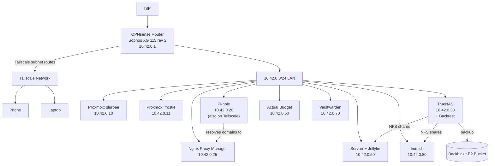

# Homelab Documentation

## Overview

This document describes the architecture, network topology, and services running in my homelab.

---

## Network

| Component | Details |
|---|---|
| Router | Sophos XG 115 rev 2, running OPNsense |
| Router IP | `10.42.0.1` |
| Position | Behind ISP LAN |
| Remote Access | Tailscale — the router advertises homelab routes over the tailnet, giving devices (phone, laptop, etc.) access to the `10.42.0.0/24` network remotely |

### DNS & Certificates

- **Pi-hole** (`10.42.0.20`) is the primary DNS resolver for the tailnet. It is connected to Tailscale separately (independent of the router's advertised routes).
- Pi-hole resolves all internal domains to **Nginx Proxy Manager**.
- **Nginx Proxy Manager** (`10.42.0.25`) handles reverse proxying and issues TLS certificates via DNS-01 validation, providing valid SSL for all internal services.

---

## Compute

Two Proxmox VE nodes host all services, distributed across VMs and LXCs:

| Node | IP |
|---|---|
| `slurpee` | `10.42.0.10` |
| `frostie` | `10.42.0.11` |

Services are spread across both nodes. All applications run as Docker Compose stacks inside their respective VMs/LXCs.

---

## Services

| Service | IP | Purpose |
|---|---|---|
| **OPNsense** | `10.42.0.1` | Router / firewall, Tailscale subnet router |
| **Pi-hole** | `10.42.0.20` | Primary DNS for the tailnet, connected to Tailscale directly |
| **Nginx Proxy Manager** | `10.42.0.25` | Reverse proxy + SSL via DNS validation |
| **TrueNAS** | `10.42.0.30` | Storage management, NFS shares for other services, runs Backrest |
| **Servarr stack + Jellyfin** | `10.42.0.50` | Media management and streaming |
| **Actual Budget** | `10.42.0.60` | Personal finance tracking |
| **Vaultwarden** | `10.42.0.70` | Password manager (Bitwarden-compatible) |
| **Immich** | `10.42.0.80` | Photo/video management and backup |

### TrueNAS (`10.42.0.30`)

- Manages all physical drives.
- Provides NFS shares consumed by other services on the network.
- Runs **Backrest**, backing up data to a **Backblaze B2** bucket.
  - Backup scope: **Immich** and **Actual Budget** data only.

### Servarr Stack (`10.42.0.50`)

Media automation and streaming stack, running as Docker Compose:

- **Sonarr** — TV show management
- **Radarr** — Movie management
- **Bazarr** — Subtitle management
- **Prowlarr** — Indexer management
- **Transmission** — Torrent client
- **Jellyseerr** — Media request management
- **Jellyfin** — Media streaming server

### Actual Budget (`10.42.0.60`)

Self-hosted personal finance/budgeting tool.

### Vaultwarden (`10.42.0.70`)

Self-hosted, lightweight Bitwarden-compatible password manager.

### Immich (`10.42.0.80`)

Self-hosted photo and video backup/management platform.

---

## Backup Summary

| What | Method | Destination |
|---|---|---|
| Immich data | Backrest (on TrueNAS) | Backblaze B2 bucket |
| Actual Budget data | Backrest (on TrueNAS) | Backblaze B2 bucket |

> **Note:** Other services (Vaultwarden, Servarr stack, Pi-hole, NPM configs) are currently **not** included in the Backblaze backup — worth reviewing whether they need their own backup strategy.

---

## Architecture Diagram

---

## Quick Reference — IP Table

| IP | Host |
|---|---|
| `10.42.0.1` | OPNsense Router |
| `10.42.0.10` | Proxmox — slurpee |
| `10.42.0.11` | Proxmox — frostie |
| `10.42.0.20` | Pi-hole |
| `10.42.0.25` | Nginx Proxy Manager |
| `10.42.0.30` | TrueNAS |
| `10.42.0.50` | Servarr stack + Jellyfin |
| `10.42.0.60` | Actual Budget |
| `10.42.0.70` | Vaultwarden |
| `10.42.0.80` | Immich |
